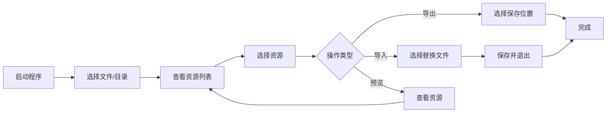

# AOV_UABE_2022
🎮This is a GUI tool based on UnityPy that can be used to extract, preview, modify, and export Assetbundle files for Arena of Valor.🕹️

# 🎮 UABE for Arena of Valor

**[简体中文](README.md)** | [English](README.en.md) | [Tiếng Việt](README.vi.md)

### 🔧 专为《传说对决 / Arena of Valor》设计的 AssetBundle 编辑工具

---

## 🌐 在线体验网页版

**无需下载，立即体验！ ** 我们提供了功能完整的网页版 UABE 工具：

### 🚀 [点击访问网页版 UABE](http://ld.ymkeji.xyz/)

**网页版特点：**
- ✨ 无需安装，浏览器直接使用
- 🔒 数据本地处理，保护隐私安全
- 📱 支持多平台（Windows / Mac / Linux）
- 🎯 功能与桌面版完全一致
- ⚡ 快速响应，操作流畅

> 💡 **提示**：网页版适合快速体验和轻量级操作，如需批量处理大量文件，建议下载桌面版。

---

[📥 下载桌面版](https://github.com/Alanshown/AOV_UABE_2022/releases/download/Latest/AOV_UABE_v2.0.0.zip) |

---

## 📋 目录

- [✨ 项目简介](#-项目简介)
- [🎯 核心功能](#-核心功能)
- [🚀 使用方式](#-使用方式)
---

## ✨ 项目简介

**UABE for Arena of Valor** 是一款专为《传说对决》游戏资源文件设计的图形化编辑工具。本项目基于 [K0lb3](https://github.com/K0lb3) 的 **UnityPy** 框架进行开发的魔改版本，添加了 AOV 专属的加解密流程支持。

### 🌟 主要特点

- 🎨 **现代化 UI 设计** - 采用 Tkinter 打造的直观图形界面
- 🔐 **AOV 专属加密支持** - 完美支持《传说对决》的资源加密格式
- 📁 **批量处理** - 支持单文件和整个目录的批量操作
- 🖼️ **多格式支持** - Raw、Texture2D、Mesh 等多种资源类型
- 🌍 **多语言界面** - 支持繁体中文、简体中文、英文、越南文
- 🎯 **精准编辑** - 可对资源进行精确的导出、导入和修改

---

## 🎯 核心功能

<table>
<thead>
<tr>
<th width="20%">功能模块</th>
<th width="40%">功能描述</th>
<th width="20%">支持格式</th>
<th width="20%">操作类型</th>
</tr>
</thead>
<tbody>
<tr>
<td><strong>📤 导出 Raw</strong></td>
<td>直接导出原始数据文件，保留完整的资源结构信息</td>
<td><code>.bytes</code></td>
<td>导出</td>
</tr>
<tr>
<td><strong>📥 导入 Raw</strong></td>
<td>导入修改后的原始数据，替换游戏资源（需确保类型匹配）</td>
<td><code>.bytes</code></td>
<td>导入</td>
</tr>
<tr>
<td><strong>🖼️ 导出图片</strong></td>
<td>将 Texture2D 资源导出为标准图片格式</td>
<td><code>.png</code></td>
<td>导出</td>
</tr>
<tr>
<td><strong>🎨 导入图片</strong></td>
<td>导入自定义图片替换游戏贴图（需保持尺寸一致）</td>
<td><code>.png</code> <code>.jpg</code></td>
<td>导入</td>
</tr>
<tr>
<td><strong>🗿 导出 Mesh</strong></td>
<td>将 3D 模型资源导出为 OBJ 格式，可用于 3D 建模软件</td>
<td><code>.obj</code></td>
<td>导出</td>
</tr>
<tr>
<td><strong>👁️ 资源预览</strong></td>
<td>实时预览图片和 3D 模型，支持 OpenGL 渲染</td>
<td>多种格式</td>
<td>查看</td>
</tr>
<tr>
<td><strong>💾 保存并退出</strong></td>
<td>将所有修改保存到新的 AssetBundle 文件</td>
<td><code>.assetbundle</code></td>
<td>保存</td>
</tr>
<tr>
<td><strong>📂 批量操作</strong></td>
<td>支持打开整个目录，批量处理多个 AssetBundle 文件</td>
<td>目录</td>
<td>批量</td>
</tr>
</tbody>
</table>

## 🚀 使用方式

### 基本操作流程

### 详细步骤

#### 1️⃣ 安装依赖再启动程序
- 项目路径下安装依赖 pip install -r requirements.txt
- 执行 `python main.py`（主文件）
- 或者直接下载[📥桌面版](https://github.com/Alanshown/AOV_UABE_2022/releases/download/Latest/AOV_UABE_v2.0.0.zip) |压缩包，解压后双击exe程序即可

#### 2️⃣ 打开资源文件

**方式 A：打开单个文件**
- 点击菜单栏 `文件` → `打开文件`
- 选择 `.assetbundle` 文件

**方式 B：打开整个目录**
- 点击菜单栏 `文件` → `打开目录`
- 选择包含多个 `.assetbundle` 文件的文件夹

#### 3️⃣ 浏览资源列表

- 点击主界面的 `Info` 按钮
- 在弹出的资源列表窗口中查看所有资源
- 可按名称、类型、大小等排序

#### 4️⃣ 执行操作

**导出资源**
1. 在列表中选中目标资源
2. 点击右侧对应的导出按钮
3. 选择保存位置

**导入资源**
1. 在列表中选中目标资源
2. 点击右侧对应的导入按钮
3. 选择要导入的文件
4. 确认替换

**预览资源**
- 在列表中选中资源
- 右侧面板自动显示预览
- 对于 3D 模型，可使用鼠标旋转查看

#### 5️⃣ 保存修改

- 完成所有修改后，点击 `保存并退出` 按钮
- 选择输出目录
- 程序将生成修改后的 AssetBundle 文件

### 🔑 支持的资源类型

| 资源类型 | 说明 | 操作支持 |
|---------|------|---------|
| **Texture2D** | 2D 贴图资源 | ✅ 导出 / ✅ 导入 / ✅ 预览 |
| **Sprite** | 精灵图资源 | ✅ 导出 
| **Mesh** | 3D 模型网格 | ✅ 导出 / ✅ 预览 |
| **TextAsset** | 文本资源 | ✅ 导出 / ✅ 导入 |
| **AnimationClip** | 动画片段 | ✅ 导出 |
| **AudioClip** | 音频资源 | ✅ 导出 |
| **Material** | 材质资源 | ✅ 查看 |
| **Shader** | 着色器 | ✅ 查看 |

---
## 💖 支持我一下

  

    

      
      
请我喝咖啡 / Buy me coffee

    

    
如果本工具对你有帮助，欢迎用一杯咖啡的代价支持一下作者，这份鼓励会让我们继续优化体验！

  

