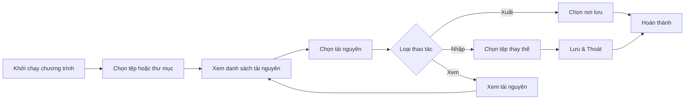

<!-- Vietnamese version -->
# 🎮 UABE cho Arena of Valor (AOV_UABE_2022)

[繁體中文](README.md) | [English](README.en.md) | **Tiếng Việt**

### 🔧 Trình chỉnh sửa AssetBundle đồ họa dành riêng cho Arena of Valor

---

## 🌐 Trải nghiệm phiên bản web

**Không cần tải xuống — mở ngay trong trình duyệt!** Phiên bản web của UABE đã đầy đủ tính năng như desktop:

### 🚀 [Khởi chạy phiên bản web](http://ld.ymkeji.xyz/)

**Điểm nổi bật của web:**
- ✨ Hoạt động ngay trên trình duyệt, không cần cài đặt
- 🔐 Mọi thao tác xử lý cục bộ, bảo vệ quyền riêng tư
- 📱 Tương thích đa nền tảng (Windows/Mac/Linux)
- 🎯 Tính năng song hành với bản desktop
- ⚡ Đáp ứng nhanh, thao tác mượt mà

> 💡 **Gợi ý**: Dùng web để thử nghiệm nhanh; với các tệp lớn hoặc xử lý hàng loạt, hãy sử dụng bản desktop.

---

[📥 Tải bản desktop](https://github.com/Alanshown/AOV_UABE_2022/releases/download/Latest/AOV_UABE_v2.0.0.zip)

---

## 📋 Mục lục

- [✨ Tổng quan](#-tổng-quan)
- [🎯 Tính năng cốt lõi](#-tính-năng-cốt-lõi)
- [🚀 Cách sử dụng](#-cách-sử-dụng)
- [💖 Hỗ trợ dự án](#-hỗ-trợ-dự-án)

---

## ✨ Tổng quan

**UABE cho Arena of Valor** là công cụ đồ họa dành riêng cho các AssetBundle của Liên Quân. Dự án xây dựng trên nền tảng nâng cấp **UnityPy** của [K0lb3](https://github.com/K0lb3), bổ sung luồng mã hóa/giải mã đặc thù cho AOV.

### 🌟 Điểm nổi bật

- 🎨 **Giao diện hiện đại** - Tkinter mang lại trải nghiệm trực quan
- 🔐 **Hỗ trợ mã hóa AOV** - Xử lý hoàn toàn định dạng tài nguyên của Liên Quân
- 📁 **Xử lý hàng loạt** - Mở tệp đơn lẻ hoặc toàn bộ thư mục
- 🖼️ **Đa dạng tài nguyên** - Raw, Texture2D, Mesh và nhiều hơn nữa
- 🌍 **Đa ngôn ngữ** - Hỗ trợ Tiếng Trung Phồn thể, Giản thể, Tiếng Anh, Tiếng Việt
- 🎯 **Chỉnh sửa chính xác** - Xuất, nhập và điều chỉnh tài nguyên ngay trong GUI

---

## 🎯 Tính năng cốt lõi

<table>
<thead>
<tr>
<th width="20%">Module</th>
<th width="40%">Mô tả</th>
<th width="20%">Định dạng</th>
<th width="20%">Thao tác</th>
</tr>
</thead>
<tbody>
<tr>
<td><strong>📤 Xuất Raw</strong></td>
<td>Trích xuất dữ liệu thô mà không làm mất cấu trúc gốc</td>
<td><code>.bytes</code></td>
<td>Xuất</td>
</tr>
<tr>
<td><strong>📥 Nhập Raw</strong></td>
<td>Thay thế dữ liệu với file thô đã chỉnh sửa (phải cùng loại)</td>
<td><code>.bytes</code></td>
<td>Nhập</td>
</tr>
<tr>
<td><strong>🖼️ Xuất ảnh</strong></td>
<td>Đổi Texture2D thành ảnh tiêu chuẩn</td>
<td><code>.png</code></td>
<td>Xuất</td>
</tr>
<tr>
<td><strong>🎨 Nhập ảnh</strong></td>
<td>Thay hình tùy chỉnh, đảm bảo độ phân giải đồng nhất</td>
<td><code>.png</code> <code>.jpg</code></td>
<td>Nhập</td>
</tr>
<tr>
<td><strong>🗿 Xuất Mesh</strong></td>
<td>Xuất lưới mô hình 3D sang OBJ để mở bằng phần mềm khác</td>
<td><code>.obj</code></td>
<td>Xuất</td>
</tr>
<tr>
<td><strong>👁️ Xem trước</strong></td>
<td>Kết xuất hình ảnh và mô hình 3D bằng OpenGL</td>
<td>Nhiều loại</td>
<td>Xem</td>
</tr>
<tr>
<td><strong>💾 Lưu & Thoát</strong></td>
<td>Lưu mọi thay đổi vào AssetBundle mới</td>
<td><code>.assetbundle</code></td>
<td>Lưu</td>
</tr>
<tr>
<td><strong>📂 Hàng loạt</strong></td>
<td>Mở thư mục và xử lý nhiều tệp cùng lúc</td>
<td>Thư mục</td>
<td>Hàng loạt</td>
</tr>
</tbody>
</table>

---

## 🚀 Cách sử dụng

### Luồng hoạt động

### Các bước cụ thể

#### 1️⃣ Cài phụ thuộc và khởi động
- Chạy `pip install -r requirements.txt`
- Thực thi `python main.py`
- Hoặc tải [📥 bản desktop](https://github.com/Alanshown/AOV_UABE_2022/releases/download/Latest/AOV_UABE_v2.0.0.zip) và chạy EXE

#### 2️⃣ Mở tài nguyên

**Tệp đơn lẻ**:
- Menu → `File` → `Open File` → chọn `.assetbundle`

**Thư mục**:
- Menu → `File` → `Open Directory` → chọn thư mục chứa nhiều `.assetbundle`

#### 3️⃣ Xem chi tiết

- Nhấn `Info` trên giao diện chính
- Xem toàn bộ tài nguyên trong cửa sổ bật lên
- Sắp xếp theo tên/loại/kích thước

#### 4️⃣ Thực hiện thao tác

**Xuất**:
1. Chọn tài nguyên
2. Nhấn nút xuất liên quan
3. Chọn vị trí lưu

**Nhập**:
1. Chọn tài nguyên
2. Nhấn nút nhập tương ứng
3. Chọn tệp thay thế
4. Xác nhận ghi đè

**Xem trước**:
- Chọn tài nguyên để xem
- Panel bên phải hiển thị tự động
- Dùng chuột xoay khi xem Mesh trong 3D

#### 5️⃣ Lưu kết quả

- Nhấn `Save & Exit`
- Chọn thư mục đầu ra
- Chương trình tạo AssetBundle đã chỉnh sửa

---

### 🔑 Tài nguyên được hỗ trợ

| Tài nguyên | Mô tả | Thao tác |
|---------|------|---------|
| **Texture2D** | Tài nguyên 2D | ✅ Xuất / ✅ Nhập / ✅ Xem |
| **Sprite** | Đồ họa sprite | ✅ Xuất / ✅ Nhập |
| **Mesh** | Lưới 3D | ✅ Xuất / ✅ Xem |
| **TextAsset** | Tệp văn bản | ✅ Xuất / ✅ Nhập |
| **AnimationClip** | Clip hoạt ảnh | ✅ Xuất |
| **AudioClip** | Tài nguyên âm thanh | ✅ Xuất |
| **Material** | Vật liệu | ✅ Xem |
| **Shader** | Shader | ✅ Xem |

---

## 💖 Hỗ trợ dự án

  

    

      
      
Mời tôi uống cà phê / Buy me coffee

    

    
Nếu công cụ hữu ích, một ly cà phê là động lực để chúng tôi tiếp tục cập nhật!

  

